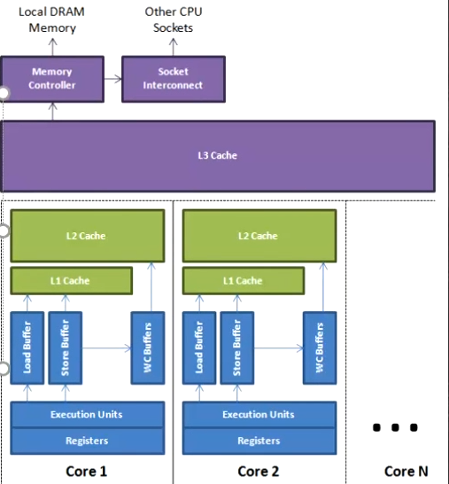

# JVM
## 概念
- jvm跟java无关
    - 任何语言->class->JVM
- jvm是一种规范
- 虚构出来的计算机
    - 字节码指令集(汇编语言)
    - 内存管理:栈 堆 方法区等
- 常见的JVM实现
    - Hotspot
        - Oracle官方,做实验用的jvm
    - Jrockit
        - BEA,最快jvm
        - 被Oracle收购,合并于hotspot
    - TaoBaoVM
        - hotspot深度定制版
    - LiquidVM
        - 直接针对硬件
    - azul zing
        - 垃圾回收的业界标杆
    - J9 -IBM
    - Microsoft VM
- JDK JRE JVM
    - JDK = jre + development kit
    - JRE = jvm + core lib
    - JVM
## Class File Format
- 二进制字节流
- 数据类型 u1 u2 u4 u8 和_info
- 前八个16进制->magic version
- 然后八个16进制->minor version
- 然后四个16进制(2个字节)-> constant_pool_count
    - 常量池
- 紧接constant_pool *
    - 长度为constant_pool_count-1的表,从1开始,保留0
    
- access_flags 定义类的那一排所代表的,例如public,final,implement,annotation
- this_class
    - 当前class文件
- super_class
- interfaces_count
- interfaces
- fields_count
- fields
- methods_count
- methods
    - access_flags
    - name_index u2
    - descriptor_index u2
    - attributes_count
    - attributes
- attributes_count -u2
- attributes
    - code

## Class Loading Linking Initializing
### loading
- 加载过程
1. Loading
2. Linking
    1. verification
    2. preparation
        - 静态变量设初值,不是赋值
    3. resolution
3. initializing
- class在内存中的位置
    - 根据虚拟机来不同考虑
        - 应该是metaspace
- 类加载器
    - JVM是按需动态加载,采用双亲委派机制 为了安全
        - java.lang.String被自定义loader,打包后发给客户,用户输密码,密码发回来
    - 父加载器
        - 父加载器不是"类加载器的加载器"类加载器都是bootstrap加载器加载的
    - 双亲委派是一个孩子向父亲方向,然后父亲向孩子方向的双亲委派过程
    - 层次
        - bootStrap
            - 加载lib/rt.jar charset.jar核心类,c++实现
        - Extension
            - 加载扩展jar包,jre/lib/ext/*.jar,或由-Djava.ext.dirs指定
        - App
            - 加载classpath指定内容
        - CustomClassLoader
            - 自定义ClassLoader
    - 自底向上检查该类是否已经加载parent方向
    - 如何打破双亲委派
        1. 如何打破:重写loadClass()
            - tomcat是重写loadClass为先自己加载,没有则找父加载器 ->热加载
                每次都重新new
        2. 何时打破过
            - jdk1.2之前,自定义ClassLoader都必须重写loadClass
            - ThreadContextClassLoader可以实现基础类调用实现类代码,通过thread.setContextClassLoader指定
            - 热启动,热部署
                - tomcat都有自己的模块指定classloader
- class加载生成两部分
    1. 二进制存入内存(在meta space中,指的是method area,1.8之前叫PermanentGeneration)
    2. 生成一个class,指向二进制内存,来读取解析二进制,反射 
- ClassLoader源码
    - findClass 自己找
    - loadClass 方法过程
        1. cache里面找
        2. parent.loadClass 父类找,递归找
        2. findClass 自己的findclass
    - 如果是AppClassLoader首先会执行URLClassLoader的findClass方法
    - 模板模式,留钩子函数,findClass
#### lazy loading
- 严格来说应该叫lazyInitializing
- JVM规范并没有规定何时加载
- 但是严格规定了什么时候必须初始化
    - new getstatic putstatic invokestatic指令,访问final变量除外
    - java.lan.reflect对类进行反射调用时
    - 初始化子类的时候,父类首先初始化
    - 虚拟机启动时,被执行的主类必须初始化
    - 动态语言支持java.lang.invoke.MethodHandle解析的结果为REF_getstatic REF_putstatic REF_invokestatic的方法句柄时
    该类必须初始化
    
- 读取final 值不加载类

#### 编译
- 混合模式  -Xmixed
    - 解释器
    - JIT(Just in Time compiler) 
    - 混合使用解释器+热点代码编译
    - 起始阶段采用解释执行
    - 热点代码检测
        - 多次调用的方法(方法计数器:检测方法执行频率)
        - 多次调用的循环(循环计数器:检测循环执行频率)
        - 进行编译 
- -Xmixed 默认混合模式开始解释执行,启动速度较快,对热点代码实行检测和编译
- -Xint Xint 使用解释模式,启动很快执行稍慢
- -Xcomp Xcomp使用纯编译模式,执行很快,启动很慢
    - exe,elf  
### Linking
1. Verification
    - 验证文件是否符合jvm规定
2. Preparation
    - 静态成员变量赋默认值
3. Resolution
    - 将类,方法,属性等引用解析为直接引用
    常量池中的各种符号引用解析为指针,偏移量等内存地址的直接引用
- 总结
    1. load-默认值-初始值
    2. new-申请内存-默认值-初始值 
### initializing
## JMM java memory model

- 内存一致性
    - 硬件层一致性
        - busLock 总线锁 ->老cpu
        - MESI 等各种各样的一致性协议(MSI,MESI,MOSI,Synapse,Firefly Dragon)
            - 缓存锁
            - 有些无法被缓存的数据或者跨越多个缓存行的数据依然必须使用总线锁
            - 缓存行(cache line) 缓存的单位,一般为64字节 512位
                - 伪共享
                    - 位于同一缓存行的两个不同数据,被两个cpu锁定,产生互相影响的伪共享问题 ->`JUC/falseSharing`
                - 缓存行对齐 -> 能够提高效率
                    - 甚至disruptor中就有相关操作
                        - 在cursor前后各填充了七个long来对其缓存行来提高效率

        - MESI ->缓存锁
            - Modified 修改加标记,m
            - Exclusive 独享标记,e
            - shared 同时在读 ,s 
            - Invalid 被别人改过了 i
        - 目前数据一致性是缓存锁+总线锁
- 指令排序

    - cpu类似内部多线程,查看没有依赖关系会乱序执行
    - 乱序读合并写 `JUC/029_WriteCombining` ->四个超快缓存 ,四个字节
    - 乱序执行JUC/jmm/Disorder
- 保证不乱序
    - cpu级别内存屏障
        - intel
            - sfence : 在sfence指令前的写操作当必须在sfence指令后的写操作前完成
            - lfence : 在lfence指令前的读操作当必须在lfence指令后的读操作前完成
            - mfence : 在mfence指令前的读写操作必须在mfence指令后的读写操作前完成
            - lock