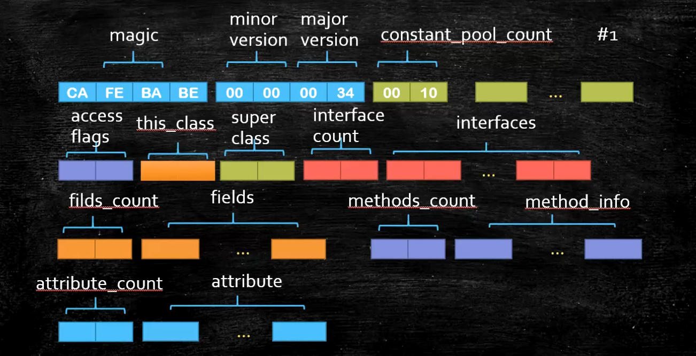

# JVM
## 概念
- jvm跟java无关
    - 任何语言->class->JVM
- jvm是一种规范
- 虚构出来的计算机
    - 字节码指令集(汇编语言)
    - 内存管理:栈 堆 方法区等
- 常见的JVM实现
    - Hotspot
        - Oracle官方,做实验用的jvm
    - Jrockit
        - BEA,最快jvm
        - 被Oracle收购,合并于hotspot
    - TaoBaoVM
        - hotspot深度定制版
    - LiquidVM
        - 直接针对硬件
    - azul zing
        - 垃圾回收的业界标杆
    - J9 -IBM
    - Microsoft VM
- JDK JRE JVM
    - JDK = jre + development kit
    - JRE = jvm + core lib
    - JVM
## Class File Format
- 二进制字节流
- 数据类型 u1 u2 u4 u8 和_info
- 前八个16进制->magic version
- 然后八个16进制->minor version
- 然后四个16进制(2个字节)-> constant_pool_count
    - 常量池
- 紧接constant_pool *
    - 长度为constant_pool_count-1的表,从1开始,保留0
    
- access_flags 定义类的那一排所代表的,例如public,final,implement,annotation
- this_class
    - 当前class文件
- super_class
- interfaces_count
- interfaces
- fields_count
- fields
- methods_count
- methods
    - access_flags
    - name_index u2
    - descriptor_index u2
    - attributes_count
    - attributes
- attributes_count -u2
- attributes
    - code


## Class Loading Linking Initializing
### loading
- 加载过程
1. Loading
2. Linking
    1. verification
    2. preparation
        - 静态变量设初值,不是赋值
    3. resolution
3. initializing
- class在内存中的位置
    - 根据虚拟机来不同考虑
        - 应该是metaspace
- 类加载器
    - JVM是按需动态加载,采用双亲委派机制 为了安全
        - java.lang.String被自定义loader,打包后发给客户,用户输密码,密码发回来
    - 父加载器
        - 父加载器不是"类加载器的加载器"类加载器都是bootstrap加载器加载的
    - 双亲委派是一个孩子向父亲方向,然后父亲向孩子方向的双亲委派过程
    - 层次
        - bootStrap
            - 加载lib/rt.jar charset.jar核心类,c++实现
        - Extension
            - 加载扩展jar包,jre/lib/ext/*.jar,或由-Djava.ext.dirs指定
        - App
            - 加载classpath指定内容
        - CustomClassLoader
            - 自定义ClassLoader
    - 自底向上检查该类是否已经加载parent方向
    - 如何打破双亲委派
        1. 如何打破:重写loadClass()
            - tomcat是重写loadClass为先自己加载,没有则找父加载器 ->热加载
                每次都重新new
        2. 何时打破过
            - jdk1.2之前,自定义ClassLoader都必须重写loadClass
            - ThreadContextClassLoader可以实现基础类调用实现类代码,通过thread.setContextClassLoader指定
            - 热启动,热部署
                - tomcat都有自己的模块指定classloader
- class加载生成两部分
    1. 二进制存入内存(在meta space中,指的是method area,1.8之前叫PermanentGeneration)
    2. 生成一个class,指向二进制内存,来读取解析二进制,反射 
- ClassLoader源码
    - findClass 自己找
    - loadClass 方法过程
        1. cache里面找
        2. parent.loadClass 父类找,递归找
        2. findClass 自己的findclass
    - 如果是AppClassLoader首先会执行URLClassLoader的findClass方法
    - 模板模式,留钩子函数,findClass
#### lazy loading
- 严格来说应该叫lazyInitializing
- JVM规范并没有规定何时加载
- 但是严格规定了什么时候必须初始化
    - new getstatic putstatic invokestatic指令,访问final变量除外
    - java.lan.reflect对类进行反射调用时
    - 初始化子类的时候,父类首先初始化
    - 虚拟机启动时,被执行的主类必须初始化
    - 动态语言支持java.lang.invoke.MethodHandle解析的结果为REF_getstatic REF_putstatic REF_invokestatic的方法句柄时
    该类必须初始化
    
- 读取final 值不加载类

#### 编译
- 混合模式  -Xmixed
    - 解释器
    - JIT(Just in Time compiler) 
    - 混合使用解释器+热点代码编译
    - 起始阶段采用解释执行
    - 热点代码检测
        - 多次调用的方法(方法计数器:检测方法执行频率)
        - 多次调用的循环(循环计数器:检测循环执行频率)
        - 进行编译 
- -Xmixed 默认混合模式开始解释执行,启动速度较快,对热点代码实行检测和编译
- -Xint Xint 使用解释模式,启动很快执行稍慢
- -Xcomp Xcomp使用纯编译模式,执行很快,启动很慢
    - exe,elf  
### Linking
1. Verification
    - 验证文件是否符合jvm规定
2. Preparation
    - 静态成员变量赋默认值
3. Resolution
    - 将类,方法,属性等引用解析为直接引用
    常量池中的各种符号引用解析为指针,偏移量等内存地址的直接引用
- 总结
    1. load-默认值-初始值
    2. new-申请内存-默认值-初始值 
### initializing
## JMM java memory model

- 内存一致性
    - 硬件层一致性
        - busLock 总线锁 ->老cpu
        - MESI 等各种各样的一致性协议(MSI,MESI,MOSI,Synapse,Firefly Dragon)
            - 缓存锁
            - 有些无法被缓存的数据或者跨越多个缓存行的数据依然必须使用总线锁
            - 缓存行(cache line) 缓存的单位,一般为64字节 512位
                - 伪共享
                    - 位于同一缓存行的两个不同数据,被两个cpu锁定,产生互相影响的伪共享问题 ->`JUC/falseSharing`
                - 缓存行对齐 -> 能够提高效率
                    - 甚至disruptor中就有相关操作
                        - 在cursor前后各填充了七个long来对其缓存行来提高效率

        - MESI ->缓存锁
            - Modified 修改加标记,m
            - Exclusive 独享标记,e
            - shared 同时在读 ,s 
            - Invalid 被别人改过了 i
        - 目前数据一致性是缓存锁+总线锁
- 指令排序

    - cpu类似内部多线程,查看没有依赖关系会乱序执行
    - 乱序读合并写 `JUC/029_WriteCombining` ->四个超快缓存 ,四个字节
    - 乱序执行JUC/jmm/Disorder
- 保证不乱序
    - cpu级别内存屏障
        - intel 硬件内存屏障,实实在在存在的
            - sfence : 在sfence指令前的写操作当必须在sfence指令后的写操作前完成
            - lfence : 在lfence指令前的读操作当必须在lfence指令后的读操作前完成
            - mfence : 在mfence指令前的读写操作必须在mfence指令后的读写操作前完成
            - 原子指令:例如x86上的"lock",指令是一个Full Barrier,执行时会锁住内存子系统来确保执行顺序,甚至跨越
            多个CPU,Software Locks通常使用了内存屏障或原子指令来实现变量可见性和保存程序顺序
        - JVM级别(JSR133),依赖于硬件内存屏障 规范
            - LoadLoad屏障
            - StoreStore屏障
            - LoadStore屏障
            - StoreLoad屏障 
- volatile
    - java->class
        - 标记ACCESS_FLAG volatile
    - jvm
        - 写操作
            1. StoreStoreBarrier
            2. volatile
            3. StoreLoadBarrier
        - 读操作
            1. LoadLoadBarrier
            2. volatile
            3. LoadStoreBarrier            
    - os
        - hsdis -hotspot dis assembler
        - Windows lock指令实现
- synchronized
    - java->class
        - ACC_SYNCHRONIZED
        -代码块
            1. monitor enter
            2. 代码块
            3. monitor exit
            4. monitor exit
            - 可能出异常,所以一个enter对应两个exit
    - jvm
        - c和c++调用了系统提供的同步机制
    - os
        - lock cmpchg/xx
### 面试题
- 关于对象
1. 解释一下对象的创建过程
    1. class loading:类加载
    2. class linking(verification preparation resolution)
        1. verification:校验文件是否为class
        2. preparation: 静态变量设默认值
        3. resolution :解析
    3. class initialization: 初始化,执行静态语句块
    4. 申请对象内存
    5. 成员变量赋默认值
    6. 调用构造方法<init>
        1. 成员变量顺序赋初始值
        2. 执行构造方法语句 
            1. super
2. 对象在内存中的存储布局
    - 观察虚拟机配置
        - java -XX:+PrintCommandLineFlags -version
    - 普通对象
        1. 对象头: markword 8
        2. ClassPointer指针: -XX:+UseCompressedClassPointers为四个字节,不开启为8字节
        3. 实例数据
            1. 引用类型: -XX:+UseCompressOops为四字节,不开启为8字节
            Oops Ordinary Object Pointers 成员变量的指针
        4. padding对齐,8的倍数 
    - 数组对象
        1. 对象头:markword 8
        2. ClassPointer 指针同上
        3. 数组长度:4字节
        4. 数组数据
        5. 对齐8的倍数
    - ObjectSizeAgent
    - HotSpot开启内存压缩的规则(64位)
        1. 4g以下直接砍掉高32位
        2. 4g-32g,默认开启内存压缩ClassPointer Oops
        3. 32G,压缩无效,使用64位,内存不是越大越好
        
3. 对象头具体包括什么
    1. 偏向锁
    2. 锁
    3. HashCode
        - 31位hashcode->System.identityHashCode(...)  -->64位机子,32位的25位 
        - 按原始内容机选hashcode,重写过的hashcode方法计算的结果不会存在这里
    4. 分代年龄->4bit,最大15
    - 
4. 对象怎么定位
    - 句柄池 -> gc算法方便(三色算法)
    - 直接指针 ->hotspot
5. 对象怎么分配
    - GC相关内容
6. Object o = new Object 在内存中占用多少字节
## JVM Runtime Data Area && JVM Instructions
### JVM Runtime Data Area 
- PC program count 线程私有
    - 存放指令位置
    - 虚拟机的运行,类似于这样的循环
      ```
      while(not end)
      {
      取PC中的位置,找到对应位置指令
      执行指令
      PC++
      }
      ```
- Heap
- Stack
    - JVM stack *** 线程私有
        - Frame - 每个方法对应一个栈帧
            1. Local Variables 局部变量表
            2. Operand Stack 操作数栈 
                - 对于long的处理(store and load),多数虚拟机的实现都是原子的jls17.7,没必要volatile
            3. dynamic linking 动态链接
                - jvms 2.6.3
                - a()调用了b(),去constant_pool找b()的链接->动态链接
            4. return address
                - a()调用b(),返回值放的位置以及继续的地址
    - native method stack 线程私有
- method area *** 逻辑概念
    - 具体实现
      1. perm Space (<1.8)
        - 字符串常量位于PermSpace
        - FGC不会清理
        ```
        for(;;) I i =C::n //Method Area  ->OOM,1.8之后不会OOM
        ```
        - 大小启动时指定,不能变
      2. meta space(>=1.8)
        - 字符串常量位于堆
        - 会触发FGC清理
        - 不设定的话最大就是物理内存
- Direct Memory
    - JVM直接访问内存空间的内存,不用再复制到jvm
    - nio,提高效率,实现zero copy
### JVM Instructions
- store
- load
- pop
- add
- mul
...
- invoke
    1. invokeStatic
        - 调用静态方法
    2. invokeVirtual
        - 自带多态
        - final方法
    3. invokeInterface
    4. invokeSpecial
        - 可以直接定位的
            - private 方法,init
    5. invokeDynamic
        - JVM最难指令
        - lambda表达式
        - 反射
        - 其他动态语言,scala,kotlin,CGLib ASM动态产生的class会用到的指令