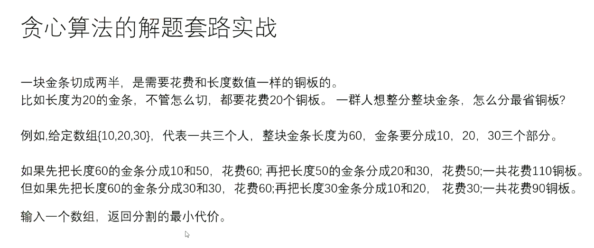

# Table of Contents

* [算法](#算法)
  * [基础](#基础)
    * [工具](#工具)
    * [运算](#运算)
    * [排序](#排序)
  * [数据结构](#数据结构)
    * [链表](#链表)
      * [快慢指针](#快慢指针)
    * [栈](#栈)
    * [队列](#队列)
    * [HashSet&HashMap](#hashsethashmap)
    * [有序表](#有序表)
    * [堆](#堆)
    * [二叉树](#二叉树)
      * [递归序](#递归序)
      * [序列化反序列化](#序列化反序列化)
      * [题目](#题目)
      * [二叉树的递归套路***](#二叉树的递归套路)
        * [规则](#规则)
        * [题目](#题目-1)
    * [前缀树](#前缀树)
  * [递归](#递归)
  * [预处理](#预处理)
    * [前缀和求数组滚动窗口和](#前缀和求数组滚动窗口和)
  * [问题范围和问题答案是否有线性规律](#问题范围和问题答案是否有线性规律)


# 算法
## 基础
### 工具
- 对数器
    - 一个想要测的方法a
    - 实现复杂度不好但是容易实现的方法b
    - 实现一个随机样本产生器
    - 方法a和方法b相同的随机样本,看看得到的结果是否一样
    - 如果一个随机样本使得比对结果不一致,打印样本进行人工干预,改对方法a和方法b
    - 当样本数量很多时对比测试依然正确,可以确定方法a已经正确

- 比较器
    1. 比较器的实质是重载比较运算符
    2. 比较器可以很好的应用在特殊标准的排序上
    3. 比较器可以很好的应用在根据特殊标准排序的结构上
        - PriorityQueue 小根堆转大根堆
    4. 写代码变得异常容易,还用于泛型编程
### 运算
- 异或运算,二进制无进位相加
    - 性质:0^N=N,N^N=0
    - 满足交换律和结合律(同一批数异或答案一样,无论顺序)
    - ab互换
        1. a = a^b
        2. b = a^b
        3. a = a^b
        - ab必须指向不同内存
    - 提取最右侧1
        - N&((~N)+1)  N与((N取反)+1)
### 排序
- 桶排序
    - 数据状况强相关
    -计数排序
        - 设数组,累加
    - 基数排序
        - 非负十进制
        - 添0,入桶出桶
        - 权重逆着
- 排序算法的稳定性
    - 稳定性是指同样大小的样本再排序之后不会改变相对次序
    - 对基础类型来说,稳定性毫无意义
    - 对非基础类型来说,稳定性有重要意义
    - 有些算法可以实现成稳定的,而有些排序算法无论如何都实现不成稳定的
    - 有稳定性: -处理相等情况时的策略
        - 冒泡排序
        - 插入排序
        - 归并排序
        - 桶排序 十分稳定
            - 基数排序
            - 计数排序
    - 无稳定性:
        - 选择排序
        - 快排
            - partition过程必破坏稳定性
        - 堆排
- 序算法总结
1. 不基于比较的排序,对样本数据有严格的要求,不易改写
2. 基于比较的排序,只要规定好两个样本怎么比大小就可以直接复用
3. 基于比较的排序,时间复杂度的极限是O(NlogN)
4. 时间复杂度O(NlogN),额外空间复杂度低于O(N),且稳定的基于比较的排序是不存在的
5. 为了绝对的速度选快排,为了省空间选堆排,为了稳定选归并
6. 小规模用常数项小的排序,例如插入排序,大规模用调度优秀的排序,如快排
- 常见的坑
    1. 归并排序的额外空间复杂度可以变成O(1),"归并排序 内部缓存法",但是将变得不再稳定 ->直接堆排
    2. "原地归并排序"是垃圾帖,会让时间复杂度变成O(N^2) ->插入排序
    3. 快排稳定性改进,"01 stable sort",但是会对样本数据要求更多 ->桶排序
    4. 在整数数组中,请把奇数放在数组左边,偶数放在数组右边,要求所有奇数之间,偶数之间的原始相对次序不变
                时间复杂度做到O(N).空间复杂度做到O(1)


排序方法|时间复杂度(平均)|时间复杂度(最坏)	|时间复杂度(最好)|空间复杂度|稳定性|复杂性
---|---|---|---|---|---|---|
直接插入排序 |O(n2)|   O(n2)	        |O(n)	    |O(1)	   |     稳定	|简单
希尔排序    |O(nlog2n)|  O(n2)	    |O(n1.3)	|O(1)	   | 不稳定	|较复杂
直接选择排序 |O(n2)|  O(n2)	        |O(n2)	    |O(1)	   |     不稳定	|简单
堆排序      |O(nlog2n)|   O(nlog2n)  |O(nlog2n)  |O(1)	   | 不稳定	|较复杂
冒泡排序    |O(n2)	|  O(n2)	    |O(n)	    |O(1)	   | 稳定 |简单
快速排序    |O(nlog2n)|  O(n2)	    |O(nlog2n)	|O(nlog2n)|	不稳定	|较复杂
归并排序    |O(nlog2n)|  O(nlog2n)	|O(nlog2n)	|O(n)      | 稳定 |较复杂
基数排序    |O(d(n+r))|  O(d(n+r))	|O(d(n+r))	|O(n+r) |	稳定 |较复杂
## 数据结构
### 链表
- 反转链表,定义pre,next避免循环链表
- 笔试 ,不用太在乎空间复杂度,一切为了时间复杂度
- 面试,时间复杂度依然第一位,但一定要找到空间最省的方法
#### 快慢指针
1.输入链表头节点,奇数长度返回中点,偶数长度返回上中点
2.输入链表头节点,奇数长度返回中点,偶数长度返回下中点
3.输入链表头节点,奇数长度返回中点前一个,偶数长度返回上中点前一个
4.输入链表头节点,奇数长度返回中点前一个,偶数长度返回下中点前一个
    - 边界问题
    - 笔试直接arraylist
5. 判断回文链表
    - 笔试 ->压栈   
    - 快慢指针
        - 找中点,后半部分压栈,直到栈空,与前面节点顺序比较
    - 不用容器
        - 中点指向空,后半链表反着指,从两端往中间遍历,直到null
        - 最后要调回来
6. 将单向链表按某值划分成左边小中间相等右边大的形式
    1. 把链表放入数组里,在数组上做partition(笔试用)
    2. 分成小中大三个部分,再把各个部分之间串起来(面试用) ->6个变量,O(N)
        - [代码](https://github.com/Anhlaidh/Coding/blob/master/src/main/java/Interview/Left/Test/LinkedList/ListPartition.java)
7. 一种特殊的单链表类描述如下
        ```java
        
        class Node {
        int value;
        Node next;
        Node rand;
        Node(int val){value = val;}
        }
        ```
    - rand指针是单链表结构中新增的指针,rand可能指向链表中任意一个节点,也可能指向null
    给定一个由Node节点类型组成的无环单链表的头节点head,请实现一个函数完成这个链表的复制,并返回新的链表的头节点
        - 要求时间复杂度O(N)
        - 要求额外空间复杂度O(1)
    1. Hash表<Node,Node> 顺着比对装一遍,再遍历,用cur和get(cur)来进行复制
    2. 构造一个对应关系,例如1'在1后面2'在2后面,3'在3后面,找random找到老节点的random再next
        最后再在next方向分离出来
8. 给定两个可能有环也可能无环的单链表,头节点head1和head2,请实现一个函数,如果两个链表相交,请返回相交的第一个节点,如果不相交,返回null
    - 要求:如果两个长度之和为N,时间复杂度请达到O(N),额外空间复杂度达到O(1)
- 判定有无环,快慢指针,第一次相遇后,慢指针不动,快指针回原点,然后一起一次移动1个,下次相遇则是入环点
    a. 给一个链表,返回入环的节点
    b. 两个无环链表相交,返回第一个相交的节点
    c. 两个有环链表,找到第一个相交的节点
9. 能不能不给单链表头节点,只给删除的节点,就能做到在链表里删掉
    - 借尸还魂,复制下一个节点的值,子节点指向下下个
        a. 只替代了内容
        b. 很大局限
        c. 抖机灵
        d. 无法删除最后一个节点
    - 不行,很大问题,以上问题,必须要给头节点
    
### 栈
- 要求可以立即返回最小值,且pop,push,getMin为O(1)
    - 单调栈(同步弹出省时间费空间)
        - 两个栈,一个栈为普通栈
        - 另一个为单调栈,普通栈压入的时候单调栈压数,小则放,大则放之前最小的
        - 可以同步大小
    - 单调栈不同步压入(费时间省空间)
        - 判断当前两个栈顶是否一样
- 用栈拼队列
    - 两个栈
        - 一个push,一个pop
        - pop的时候倒过来再输出
            - pop栈为空的时候才可输出
            - push一次性倒完
### 队列
- 用队列拼栈
    - 分两个队列,data,help
        - 取的时候把data元素扔到help中,剩一个,输出
        - 然后help为data,data为help
### HashSet&HashMap
    - 增删改查均为O(1)
    - Integer等大类型在HashMap,HashSet中是按值传递
### 有序表 
- TreeMap 
    - firstKey() 最小的
    - lastKey() 最大的
    - 离xx最近且小于的 floorKey(xx)
    - 离xx最近且大于的 ceilingKey(xx)
    - O(logN)
- AVl
- 红黑树
- 跳表
### 堆
- 结构上:完全二叉树
    - 0开始
        - i的左子节点 2*i+1
        - i的右子节点 2*i+2
        - 父节点(i-1)/2
    - 1开始
        - i的左孩子 2*i  
    - 小根堆
        - 父节点是最小的
    - 均不是则不是堆
- [堆排序](https://github.com/Anhlaidh/Coding/blob/master/src/main/java/Interview/Left/Heap/HeapSort.java)
    - 有关题目
        - 几乎有序的数组排序,每个数去往的位置不超过k
            - 生成小根堆
            - 前k+1放入小根堆
            - 当前最小的可能性 
- PriorityQueue
    - 小根堆
    - poll方法,由小到大弹出
### 二叉树
- 先序
- 中序
- 后序
#### 递归序
- 递归转迭代
    - 压栈
        - 头右左
            1. 弹
            2. 如果有左,压入左
            3. 如果有右,压入右 
        - 左右节点反着压
        - 输出压栈
#### 序列化反序列化
- 留null 
#### 题目
- 打印二叉树
- 后继节点
    - 一棵二叉树,在中序遍历的序列中一个节点的下一个节点是谁,就是后继节点
        - 找结构规律
    - 凹凸折痕
#### 二叉树的递归套路***
- 可以解决面试中绝大多数的二叉树问题,尤其树形dp
- 本质是利用递归遍历二叉树的便利性
##### 规则
1. 假设以X节点位头,可以向X左树和X右树要任何信息
2. 在上一步的假设下,讨论以X为头节点的树,得到答案的可能性(最重要)
3. 列出所有可能性后,确定到底需要向左树和右树要什么样的信息
4. 把左树信息和右树信息求全集,就是任何一棵子树都需要返回的信息S
5. 递归函数都返回S,每一棵子树都这么要求
6. 写代码,在写代码中考虑如何把左树的信息和右树的信息整合出整棵树的信息

##### 题目
1. [给定一棵二叉树的头节点位head,返回这颗二叉树是不是平衡二叉树](https://github.com/Anhlaidh/Coding/blob/master/src/main/java/Interview/Left/Tree/isBalance.java)
2. 给定一棵二叉树的头节点head,任何两个节点之家你都存在距离,返回整棵二叉树的最大距离
3. 给定一棵二叉树的头节点head,返回这颗树中最大的二叉搜索子树的头节点数 
4. 派对的最大快乐值,多叉树
    - 这个公司要开party,决定哪些员工来,哪些员工不来
        1. 如果某个员工来了,那么这个员工的所有直接下级都不能来
        2. 派对的整体快乐值是所有到场员工的快乐值的累加
        3. 你的目标是让派对的快乐值尽量大
        4. 给定一棵多叉树的头节点boss,返回派对的最大快乐值
5. [给定一个二叉树头,判断是否是完全二叉树](https://github.com/Anhlaidh/Coding/blob/master/src/main/java/Interview/Left/Tree/isCBT.java)
6. 给定一棵二叉树的头节点head,和另外两个节点a和b,返回a和b的最低公共祖先
    - hashset做 巨简单 `//TODO`
    - [递归](https://github.com/Anhlaidh/Coding/blob/master/src/main/java/Interview/Left/Tree/Code07_lowestAncestor.java) 巨难
### 前缀树
- 单个字符串中,字符从前到后的加到一棵多叉树上
- 字符放在路上,节点上又专属的数据项(常见的是pass和end值) 
- 所有样本都这样添加,如果没有就新建,如果有路就复用
- 沿途节点的pass值增加1,每个字符串结束时的节点end增加1

可以完成前缀相关的查询
### 图
- BFS [宽度优先遍历](https://github.com/Anhlaidh/Coding/blob/master/src/main/java/Interview/Left/graph/BFS.java)
- DFS [深度优先遍历](https://github.com/Anhlaidh/Coding/blob/master/src/main/java/Interview/Left/graph/DFS.java)
- [题目先变换成自己掌握的结构]((https://github.com/Anhlaidh/Coding/blob/master/src/main/java/Interview/Left/graph/Graph.java))
- 拓扑排序 -> 依赖问题
- 最小生成树
    - kruskal(用最小边找所有点)
        - 由小到大union操作,直到包含所有元素
        - 并查集
    - prime(用出发点找最小边循环解锁所有点)
        - 点边点边解锁,点集,边集(由小到大,堆)
    - Dijkstra(给定出发点找到出发点通往其他所有点的最短路径)
        - 给定出发点
            - 创建一个对出发点负责的表
            - 贪心
            - 表中依次解锁新可达边/更新最短距离,锁死已检索的边
        - 找到图中这个点到所有节点的最小值
        - TSP问题(商旅问题) 不同于Dijkstra
            - 出发回自己城市,经过所有城市且只有一次,求最小代价
        - 优化
            - 建表使用小根堆(自己写,系统不能改写时重排序)
                - add, update,ignore
## 递归
- Master公式
    - T(N) = aT(N/b)+O(N^d)
        - 子问题的规模是一致的(N/b)
        - 子问题调用了a次
        - 除了子问题调用之外,生下的复杂度为O(N^d)
        - log(b)a>d,O(N^log(b)a)
        - log(b)a<d,O(N^d)
        - log(b)a==d,O(N^d(*logN))

- 归并排序 思想
    - 左边数量多少个大,左边数量多少个小,右边数量多少个大,右边数量多少个小(用mergeSort改)
        - 在一个数组中,一个数左边比他小的数的总和,叫数的小和,所有数的小和累加起来,叫数组小和,求数组小和
            - 加返回值,修改merge()
        - 降序对 - 右边有多少个数比它小
- 快排 思想
    - 指定num,将数组分为小于等于num的和大于num的两个区
        - 设定小于等于区从-1开始,然后指针遍历数组直到越界
            - 如果当前数字大于num则不动,cur指针+1
            - 如果当前数字小于等于num,cur指针的数于小于等于区指针的数互换,小于等于区指针++,cur指针++
    - 给定num分成三块,小于区,等于区,大于区 
        - 分三个区,小于区,等于区,大于区,i跟大于区边界撞上的时候停止
            - arr[i]==num,i++
            - arr[i]<num,arr[i]与小于区的右一个交换(有等于的情况,与之前思路不同 ),小于区右扩,i++
            - arr[i]>num,arr[i]与大于区做一个交换,大于区左扩,i不变
    - 荷兰国旗问题
        - 以arr[R]划分
    - 快排1.0 O(n)
        - mid放中间,左右两侧递归
        - 有序的时候效率最低
    - 快排2.0 O(n)
        - 荷兰国旗问题,分为小于区,等于区,大于区,一次可以搞定一批等于的mid  
        - 有序的时候效率最低
    - 快排3.0随机快排 O(N logN)->概率累加期望 额外空间复杂度O(logN)
        - 随机找一个值跟arr[R]交换,然后执行2.0
    

## 贪心算法
1. 最自然智慧的算法
2. 用一种局部最功利的标准,总是做出在当前来看最好的选择
3. 难点在于证明局部最功利的标准可以得到全局最优解
4. 对于贪心算法的学习主要以增加阅历为主
### 并查集
1. 有若干个样本a,b,c,d类型设为V
2. 在并查集中一开始认为每个样本都在单独的集合里
3. 用户可以在任何时候调用如下两个方法:
    - boolean isSameSet(V x,V y)查询到样本x和样本y是否属于同一个集合  
      void union(V x, V y)把x和y各自所在的样本合并成一个集合
    - isSameSet和union方法代价越低越好
      
### 过程
1. 实现一个不依靠贪心策略的解法X,可以用最暴力的尝试
2. 脑补出贪心策略A,策略B,策略C
3. 解法X和对数器,用实验方式得知哪个最正确
4. 不要去纠结证明
### 题目
1. 给定一个由字符串组成的数组strs必须把所有的字符串拼接起来
 返回所有可能的拼接结果中,字典序最小的结果
    - 暴力,全排列,深度优先
    1. 长度一样看成一个26进制的数                                                                               '*'表示居民点,可以                                                                                                                         放灯,需要点亮,如果灯放在i位置,可       以让i-1,i和i+1三个位置被点亮,返回如果点亮str中所有需要点亮的位置,至少需要几盏灯
4. 哈夫曼树
    - 去平均
    - 小根堆,取两个最小的,相加,放回去,且加入节点,从下向上形成哈夫曼树
    - 代价为非叶子节点的和
    - [最小花费](https://github.com/Anhlaidh/Coding/blob/master/src/main/java/Interview/Left/greedy/lessMoney.java)
        - 
5. 
## 暴力递归
暴力递归就是尝试
1. 把问题转化为规模缩小了的同类问题的子问题
2. 有明确的不需要继续进行递归的条件(base case)
3. 有当得到了子问题的结果之后的决策过程
4. 不记录每一个子问题的解
### 题目
1. [汉诺塔](https://github.com/Anhlaidh/Coding/blob/master/src/main/java/Interview/Left/ViolentRecursion/hanoi.java)
    - 移动步数 (2^N)-1
2. [给一个栈,逆序这个栈,不能申请额外数据结构,只能使用递归函数](https://github.com/Anhlaidh/Coding/blob/master/src/main/java/Interview/Left/ViolentRecursion/hreverseStack.java)
3. 打印字符串字串/子序列
    - 字串
        - [全排列](https://github.com/Anhlaidh/Coding/blob/master/src/main/java/Interview/Left/ViolentRecursion/AllPermutations.java)
            - 去重-->容器set
                - 分支定界 ->用set来登记,限制不必要的支路在源头杀死
    - [子序列](https://github.com/Anhlaidh/Coding/blob/master/src/main/java/Interview/Left/ViolentRecursion/subSequence.java) 
        - 去重-->容器用set
        - 子序列数量-->动态规划
#### 往左往右尝试模型
- 规定1和A对应,2和B对应...那么一个数字字符串"111"会转换成 "AAA" "AK" "KA"
    - 问总共多少转化结果
 
## 预处理
### 前缀和求数组滚动窗口和   
## 问题范围和问题答案是否有线性规律
- 双端队列
    - 最xx优先级队列
    - 滑动窗口问题
- 单调栈
