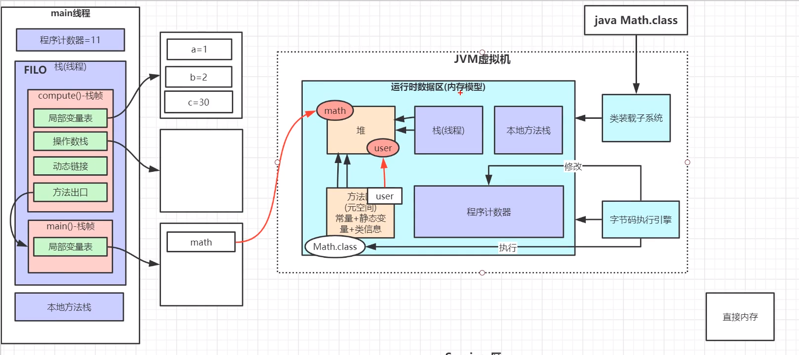

# 面试
## JVM

### 类加载器
- 双亲委派机制:安全
     - App-->EXC--BOOT(最终执行)
     1. 类加载器收到类加载的请求
     2. 将这个请求向上托付给父类加载器去完成,一直向上委托,直到启动类加载器
     3. 启动加载器检查是否能够加载当前这个类,能加载就结束,使用当前加载器,否则抛出异常,通知子类加载器进行加载 
     4. 重复步骤3
     - 最底层用c写,所以返回null,java获取不到
     
- BootstrapClassLoader（启动类加载器）
    - c++编写，加载java核心库 java.*,构造ExtClassLoader和AppClassLoader。由于引导类加载器涉及到虚拟机本地实现细节，开发者无法直接获取到启动类加载器的引用，所以不允许直接通过引用进行操作
- ExtClassLoader （标准扩展类加载器）
    - java编写，加载扩展库，如classpath中的jre ，javax.*或者java.ext.dir 指定位置中的类，开发者可以直接使用标准扩展类加载器。
- AppClassLoader（系统类加载器）
    - java编写，加载程序所在的目录，如user.dir所在的位置的class

CustomClassLoader（用户自定义类加载器）
java编写,用户自定义的类加载器,可加载指定路径的class文件

### 沙箱安全机制
### native
- 凡是带了native关键字的,说明java的作用范围达不到了,去底层调用c语言,会进入本地方法栈
java native interface
- JNI :扩展Java的使用,融合不同的编程语言为Java所用
### PC 寄存器
- 每个线程都有一个程序计数器,是线程私有的,是一个指针,指向方法去种的方法字节码(用来存储指向像一条指令的地址
,也即将要执行的代码),在执行引擎读取下一条指令,是一个非常小的空间,几乎可以忽略不计
### 方法区
- 方法去被所有线程共享,所有字段和方法字节码,以及一些特殊方法,如构造函数,接口代码也在此定义
简单说,所有定义的方法都保存在该区域,此区域属于共享区间
    - 静态变量,常量,类信息(构造方法,接口定义),运行时的常量池存在方法区中,但是实例变量存在堆内存中,和方法区无关
jvisualvm

### 栈 

#### 栈帧
一个方法对应一块栈帧内存区域

1. 局部变量表
2. 操作数栈
3. 动态链接
4. 方法出口

### 程序计数器
### javap
`javap -c xxx.class`反编译 `> xxx.txt`
### 堆
#### 直接内存

1. 年轻代(1/3)
    - Eden(8/10)(minor gc区)
    - Survivor区(2/10)
        - s0(1/10)
        - s1(1/10)
2. 老年代(2/3)

#### 垃圾回收
- gcRoot : 线程栈的本地变量,静态变量,本地方法栈的变量等等
- Object

- jdk1.6之前:永久代,常量池在方法区
- jdk1.7:永久代,慢慢退化,`去永久代` ,常量池在堆中
- jdk1.8之后:无永久代,常量池在元空间

1. Eden堆满 -->minorgc( 查找gcRoot-->可达性分析算法 -->分代年龄+1 -->复制到s0堆,清理Eden)
2. Eden堆满 -->minorgc( 查找gcRoot-->可达性分析算法 -->分代年龄+1 -->复 制到s1堆,清理Eden+s1)
之后s1 s2 反复横跳
3. 分代年龄>=15时,转移到老年代堆
4. 老年代堆满-->full gc -不能回收-> OOM

### 调优
- 目的: 减少STW(stop the world)
- gc的时候会停止所有线程 为什么?

## MySQL
- 慢SQL -优化-> 加索引
- 索引:
采用B+树数据结构,两次IO,内存取数
16kb一层 1170*1170*16,单个节点8kb,6kb

- 聚集索引:叶子节点包含数据
- 非聚集索引:MYI查找后从MYD中找数据(通过磁盘地址)
- innodb 必有主键索引,如果没设置,会构建隐藏列维护表结构

联合索引
排序 数据结构 B+Tree

## Redis
## JMM
JSR-133
### 并行消息
- 线程:程序进行的载体
- JMM 八大原子操作
    - lock
    - unlock
    - read
    - load
    - use
    - assign
    - store
    - write

- volatile 可见性原理
    - 底层实现: 通过汇编lock前缀指令触发底层缓存锁定机制(缓存一致性协议&总线锁)
- 缓存一致性协议:
    - msi mesi
    
### 分布式锁
- synchronized
    - 基于c++,语言实现的同步机制
- AQS 同步器

## HashMap
数组+链表
- 红黑树:
- 接近平衡的二叉搜索树,在每个节点上增加一个存储位表示节点的颜色,可以是Red
    可以是Black,通过对任何一条从根到叶子的路径上各个节点着色方式的限制,红黑树确保没有一条
    路径会比其他路径长处两倍,因而是接近平衡的
    - 支持查找,插入,删除等操作,复杂度最坏为O(logn)
    - 每个节点要么红要么黑
    - 根节点是黑的
    - 每个叶子节点(叶节点即指树尾端NIL指针或NULL节点)都是黑的
    - 如果一个节点是红的,那么他的两个子节点都是黑的
    - 对于任意节点而言,其到叶子节点树尾端NIL指针的每条路径都包含相同数目的黑节点
数组长度必须2的指数幂
寻找最近的较大的2的指数幂

线程不安全
多线程扩容
会形成环形链表

扩容因子:0.75

## Spring

### SpringIOC
#### 控制反转(目的) 依赖注入(手段)
1. 谁控制谁 IOC控制对象
2. 控制什么 对象
3. 为什么要反转
4. 哪些方面反转了 创建权力反转
### ApplicationContext
- ApplicationContext
- BeanFactory
    - IOC容器
        - singletonObjects 单例缓存池
        - BeanDefinitionSet
        ...一系列组件
Spring Bean 生命周期
@controller等注解被解析成BeanDefinitionSet->
bean定义对象->BeanFactoryPostProcessor->getBean()->BeanPostProcessor->单例对象生成好
### SpringBoot
- 自动装配
- 自动流程{
    jar包
    war包
}
-  @Import