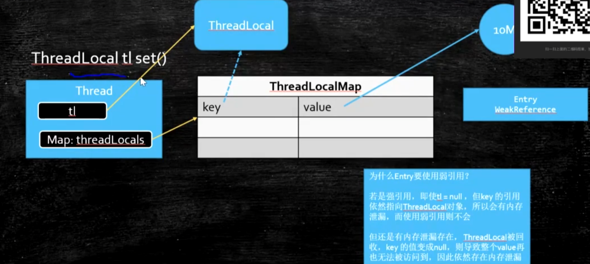

# JUC
## CAS

- asm :汇编
- cmpchg: compare and change
- if_mp:多个cpu,加锁
- 写的过程中被改变?所以不能保证原子性
- lock cmpxchg指令
    - 保证原子性,过程锁住
- 硬件
    - lock指令在执行后面指令的时候锁定一个北桥信号
## synchronized
- 偏向锁  时延4s 取消参数:-XX:BiasedLockingStartupDelay=0
    - 标记偏向锁位
    - 记录JavaThread
- 偏向锁->自旋锁 任何竞争都会触发,先取消偏向锁,然后一起抢自旋锁
    - 自旋锁:Lock Record指针谁成功cas改成了就是谁的,一直自旋尝试修改
- 自旋超过10次,升级成重量级锁(是可以修改次数的 -XX:PreBlockSpin)
    - 重量级锁   指向互斥量的指针   
        - 队列 wait notify等,不消耗cpu
- 锁降级 gc的时候触发,没人引用了已经,所以没意义
- 锁消除 是不可公用资源时 不会被其他人引用会取消锁 StringBuffer 的append
- 锁粗化 加在上一层的代码块上
- 字节码级别: monitorenter  monitorexit
- 执行过程中自动升级
- lock cmxchg
## volatile
- 线程可见性
- 指令重排序
### 内存屏障
- JSR
    - loadload
    - storestore
    - loadstore
    - storeload
- hotspot

- fence()
    - 为什么不用原语屏障  --->移植性不好
- lock
    - 锁总线

### MESI
- modified
- Exclusive
- Shared
- Invalid
- 超过缓存行不能保证一致性  ---> 锁总线
### DCL
- 为什么check两次
    - 在半初始化状态被别人拿走创建对象并指向后,又创建了新的对象并指向
- 为什么volatile
    - 如果指令重排序 某个线程就可能会拿到半初始化的对象,即默认值,前面的累加等操作就会白做
## 超线程
- ALU 单元对多个寄存器单元 单核双线程的由来
- 线程 cpu执行的基本单位
- 进程 cpu分配资源的基本单位
## cache line
```
1. Cacheline：cpu中高速缓存（L1，L2）的每一行的大小。取决于cpu，x86的cacheline一般为64B，L1一般为32KB.

2. Pagecahe：主存中页缓存，linux默认的页大小是4KB。
```
- 按块读 8字节
## 对象内存
### 普通对象
- markword 8字节 8 记录锁信息(synchronized)
- class pointer 4字节 8
- instance data 0 0
- padding 4字节 0
    - 对其到能被8整除
- 
### 数组
## ThreadLocal
