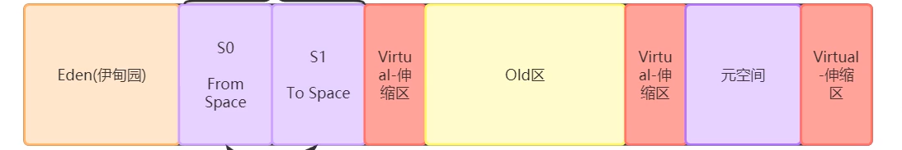

# 面试
## JVM
jvisualvm

### 栈

#### 栈帧
一个方法对应一块栈帧内存区域

1. 局部变量表
2. 操作数栈
3. 动态链接
4. 方法出口

### 程序计数器
### javap
`javap -c xxx.class`反编译 `> xxx.txt`
### 堆
#### 直接内存

1. 年轻代(1/3)
    - Eden(8/10)(minor gc区)
    - Survivor区(2/10)
        - s0(1/10)
        - s1(1/10)
2. 老年代(2/3)

#### 垃圾回收
- gcRoot : 线程栈的本地变量,静态变量,本地方法栈的变量等等
- Object

1. Eden堆满 -->minorgc( 查找gcRoot-->可达性分析算法 -->分代年龄+1 -->复制到s0堆,清理Eden)
2. Eden堆满 -->minorgc( 查找gcRoot-->可达性分析算法 -->分代年龄+1 -->复 制到s1堆,清理Eden+s1)
之后s1 s2 反复横跳
3. 分代年龄>=15时,转移到老年代堆
4. 老年代堆满-->full gc -不能回收-> OOM

### 调优
- 目的: 减少STW(stop the world)
- gc的时候会停止所有线程 为什么?

## MySQL
- 慢SQL -优化-> 加索引
- 索引:
采用B+树数据结构,两次IO,内存取数
16kb一层 1170*1170*16,单个节点8kb,6kb

- 聚集索引:叶子节点包含数据
- 非聚集索引:MYI查找后从MYD中找数据(通过磁盘地址)
- innodb 必有主键索引,如果没设置,会构建隐藏列维护表结构

联合索引
排序 数据结构 B+Tree

## Redis
## JMM
JSR-133
### 并行消息
- 线程:程序进行的载体
- JMM 八大原子操作
    - lock
    - unlock
    - read
    - load
    - use
    - assign
    - store
    - write

- volatile 可见性原理
    - 底层实现: 通过汇编lock前缀指令触发底层缓存锁定机制(缓存一致性协议&总线锁)
- 缓存一致性协议:
    - msi mesi
    
### 分布式锁
- synchronized
    - 基于c++,语言实现的同步机制
- AQS 同步器

## HashMap
数组+链表
- 红黑树:
- 接近平衡的二叉搜索树,在每个节点上增加一个存储位表示节点的颜色,可以是Red
    可以是Black,通过对任何一条从根到叶子的路径上各个节点着色方式的限制,红黑树确保没有一条
    路径会比其他路径长处两倍,因而是接近平衡的
    - 支持查找,插入,删除等操作,复杂度最坏为O(logn)
    - 每个节点要么红要么黑
    - 根节点是黑的
    - 每个叶子节点(叶节点即指树尾端NIL指针或NULL节点)都是黑的
    - 如果一个节点是红的,那么他的两个子节点都是黑的
    - 对于任意节点而言,其到叶子节点树尾端NIL指针的每条路径都包含相同数目的黑节点
数组长度必须2的指数幂
寻找最近的较大的2的指数幂

线程不安全
多线程扩容
会形成环形链表

扩容因子:0.75

## Spring

### SpringIOC
#### 控制反转(目的) 依赖注入(手段)
1. 谁控制谁 IOC控制对象
2. 控制什么 对象
3. 为什么要反转
4. 哪些方面反转了 创建权力反转
### ApplicationContext
- ApplicationContext
- BeanFactory
    - IOC容器
        - singletonObjects 单例缓存池
        - BeanDefinitionSet
        ...一系列组件
Spring Bean 生命周期
@controller等注解被解析成BeanDefinitionSet->
bean定义对象->BeanFactoryPostProcessor->getBean()->BeanPostProcessor->单例对象生成好
### SpringBoot
- 自动装配
- 自动流程{
    jar包
    war包
}
-  @Import